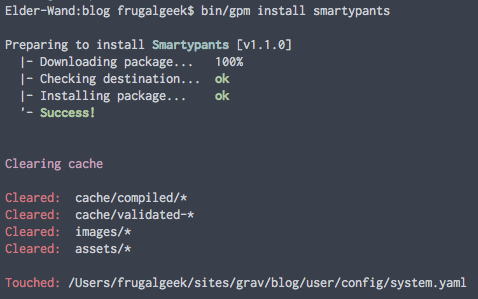

# Grav Smartypants Plugin

`Smartypants` is a [Grav](http://github.com/getgrav/grav) v0.9.5+ plugin that SmartyPants is a typography prettifyier tool for web writers. It easily translates plain ASCII punctuation characters into "smart" typographic punctuation HTML entities.

# Installation

Installing the Smartypants plugin can be done in one of two ways. Our GPM (Grav Package Manager) installation method enables you to quickly and easily install the plugin with a simple terminal command, while the manual method enables you to do so via a zip file. 

## GPM Installation (Preferred)

The simplest way to install this plugin is via the [Grav Package Manager (GPM)](http://learn.getgrav.org/advanced/grav-gpm) through your system's Terminal (also called the command line).  From the root of your Grav install type:

    bin/gpm install smartypants

This will install the Smartypants plugin into your `/user/plugins` directory within Grav. Its files can be found under `/your/site/grav/user/plugins/smartypants`.

## Manual Installation

To install this plugin, just download the zip version of this repository and unzip it under `/your/site/grav/user/plugins`. Then, rename the folder to `smartypants`. You can find these files either on [GitHub](https://github.com/getgrav/grav-plugin-smartypants) or via [GetGrav.org](http://getgrav.org/downloads/plugins#extras).

You should now have all the plugin files under

    /your/site/grav/user/plugins/smartypants

>> NOTE: This plugin is a modular component for Grav which requires [Grav](http://github.com/getgrav/grav), the [Error](https://github.com/getgrav/grav-plugin-error) and [Problems](https://github.com/getgrav/grav-plugin-problems) plugins, and a theme to be installed in order to operate.

# Usage

The `smartypants` plugin comes with some sensible default configuration, that are pretty self explanatory:

# Options

    enabled: true           // Enables or Disables the entire plugin for all pages.
    process: true           // Processes Smartypants (can be set on specific pages to enable processing individually)
    options: qDew           // Smartypants-specific configuration options

The options are described in detail on the [PHP SmartyPants GitHub Site](https://github.com/michelf/php-smartypants): https://github.com/michelf/php-smartypants

To customize the plugin, you first need to create an override config. To do so, create the folder `user/config/plugins` (if it doesn't exist already) and copy the [smartypants.yaml](smartypants.yaml) config file in there and then make your edits.

Also you can override the default options per-page:

    ---
    title: My Page
    smartypants:
        process: true
        options: qd
    ---

    # "Lorem ipsum dolor sit amet"

There are two main scenarios:

1. **Disabled** by default by setting `process: false` in your `user/config/plugins/smartypants.yaml` then enable per page with `smartypants: process: true` in your page headers.
2. **Enabled** by default by setting `process: true` in your `user/config/plugins/smartypants.yaml` then disable per page with `smartypants: process: false` in your page headers.

# Updating

As development for the Smartypants plugin continues, new versions may become available that add additional features and functionality, improve compatibility with newer Grav releases, and generally provide a better user experience. Updating Smartypants is easy, and can be done through Grav's GPM system, as well as manually.

## GPM Update (Preferred)

The simplest way to update this plugin is via the [Grav Package Manager (GPM)](http://learn.getgrav.org/advanced/grav-gpm). You can do this with this by navigating to the root directory of your Grav install using your system's Terminal (also called command line) and typing the following:

    bin/gpm update smartypants

This command will check your Grav install to see if your Smartypants plugin is due for an update. If a newer release is found, you will be asked whether or not you wish to update. To continue, type `y` and hit enter. The plugin will automatically update and clear Grav's cache.

## Manual Update

Manually updating Smartypants is pretty simple. Here is what you will need to do to get this done:

* Delete the `your/site/user/plugins/smartypants` directory.
* Downalod the new version of the Smartypants plugin from either [GitHub](https://github.com/getgrav/grav-plugin-smartypants) or [GetGrav.org](http://getgrav.org/downloads/plugins#extras).
* Unzip the zip file in `your/site/user/plugins` and rename the resulting folder to `smartypants`.
* Clear the Grav cache. The simplest way to do this is by going to the root Grav directory in terminal and typing `bin/grav clear-cache`.

> Note: Any changes you have made to any of the files listed under this directory will also be removed and replaced by the new set. Any files located elsewhere (for example a YAML settings file placed in `user/config/plugins`) will remain intact.

